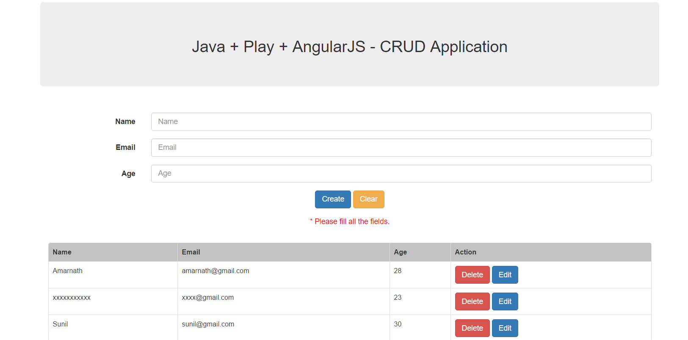

## Play SQL Demo

Using Postgresql as database to the Play application.

You can check how to connect to postgresql in **application.conf** file.

Application running live [here](https://peaceful-reaches-92756.herokuapp.com/)
